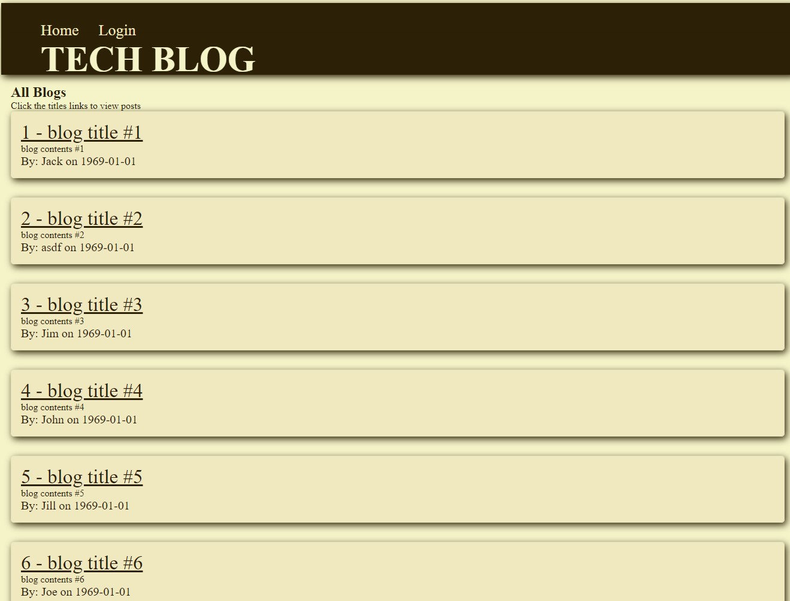

# TECH BLOG

Repository Name: mvc-tech-blog

## Table of Contents (Optional)

* [Description](#description)
* [Technologies](#technologies)
* [Installation](#installation)
* [Usage](#usage)
* [Final Product](#final-product)
* [Video](#video)
* [License](#license)
* [Acknowledgements](#acknowledgements)

## Description 

  This is a full stack web application that provides front end design supported by back end server storage to provide the user with a technology centric blog platform for idea sharing.


* An example of one of the get routes featured within.
```md

router.get('/:id', withAuth, async (req, res) => {
  try {
    const getBlog = await Blog.findByPk(req.params.id, {
      include: [
        {
          model: User,
          attributes: ["username"],
        },
        {
          model: Comment,
          separate: true,
          order: [["created_at", "DESC"]],
          include: [{ model: User, attributes: ["username"] }],
        },
      ],
    });
    if (!getBlog) {
      res.status(404).json({ message: 'No blog found with that id!' });
      return;
    }
    res.status(200).json(getBlog);
  } catch (err) {
    res.status(500).json(err);
  }
});
```

## Technologies

Technologies used on this project include:
* Frontend Javascript and handlebars to manage user experience
* Backend Javascript to handle server data management
* Node.JS
* Express
* Handlebars
* Sequelize
* NPM
* MySQL Server
* JAWS_DB Cloud Server
* Heroku Deployment


## Installation

* No installation necessary, simply visit the site!

## Usage 


1. Visit the website and enjoy!


## Final Product




Github Repository:
https://github.com/mvc-tech-blog

Deployed Site:
https://blec-mvc-tech-blog.herokuapp.com/


## Video

[]( "Video")


## License

MIT License

Copyright (c) 2022 Brennan LeClair

Permission is hereby granted, free of charge, to any person obtaining a copy
of this software and associated documentation files (the "Software"), to deal
in the Software without restriction, including without limitation the rights
to use, copy, modify, merge, publish, distribute, sublicense, and/or sell
copies of the Software, and to permit persons to whom the Software is
furnished to do so, subject to the following conditions:

The above copyright notice and this permission notice shall be included in all
copies or substantial portions of the Software.

THE SOFTWARE IS PROVIDED "AS IS", WITHOUT WARRANTY OF ANY KIND, EXPRESS OR
IMPLIED, INCLUDING BUT NOT LIMITED TO THE WARRANTIES OF MERCHANTABILITY,
FITNESS FOR A PARTICULAR PURPOSE AND NONINFRINGEMENT. IN NO EVENT SHALL THE
AUTHORS OR COPYRIGHT HOLDERS BE LIABLE FOR ANY CLAIM, DAMAGES OR OTHER
LIABILITY, WHETHER IN AN ACTION OF CONTRACT, TORT OR OTHERWISE, ARISING FROM,
OUT OF OR IN CONNECTION WITH THE SOFTWARE OR THE USE OR OTHER DEALINGS IN THE
SOFTWARE.


### Acknowledgements

©Brennan LeClair
